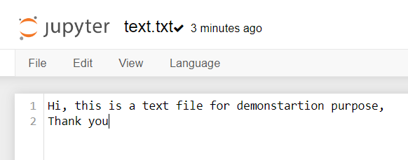
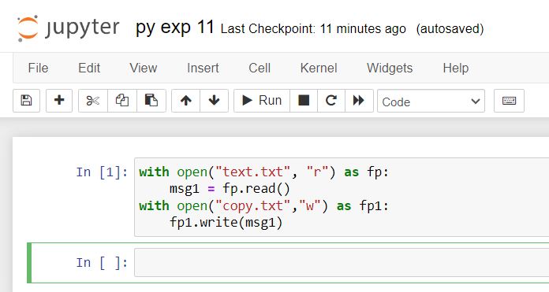
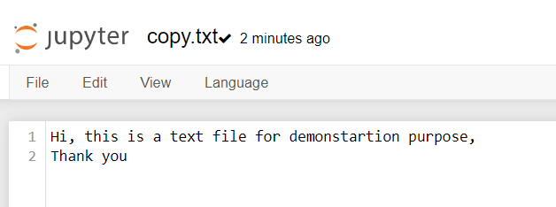

# Copy-File
## AIM:
To write a python program for copying the contents from one file to another file.
## EQUIPEMENT'S REQUIRED: 
PC
Anaconda - Python 3.7
## ALGORITHM: 
### Step 1:
Define the function as copy with arguements as existing file name and new file name.
### Step 2: 
 Open the existing file to read.
### Step 3: 
Open the new file to write.
### Step 4:  
Copy the contents from existing file to new file.
### Step 5: 
Get the inputs from the user for existing file and new file. Call the function.
### Step 6: 
End the program.

## PROGRAM:
```
/*
A python program for copying the contents from one file to another file:
Developed by: S.Sajetha
Register no: 212223100049
*/
```
```
with open("text.txt", "r") as fp:
    msg1 = fp.read()
with open("copy.txt","w") as fp1:
    fp1.write(msg1)
```
## OUTPUT:
### text.txt:

### code:

### copy.txt:

## RESULT:
Thus the program is written to copy the contents from one file to another file.
